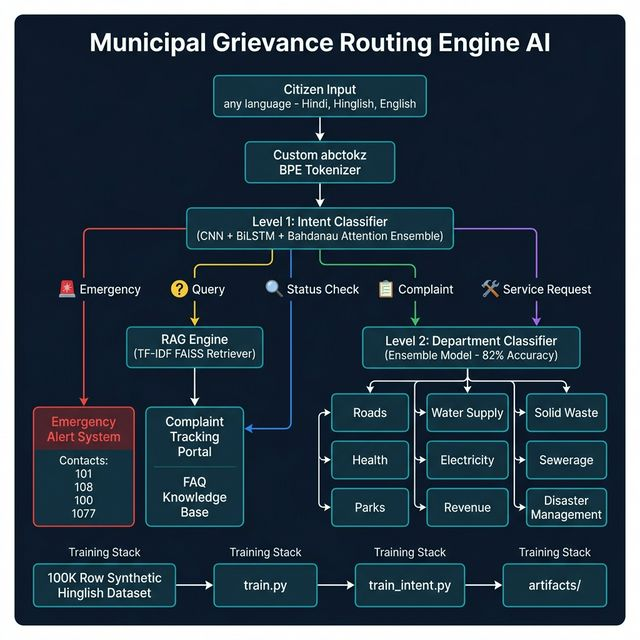

# Municipal Grievance Routing Engine (MPR)
> A two-tier, multilingual AI system for intelligently classifying, routing, and responding to citizen grievances in Hinglish, Hindi, and English.



---

## Overview

The Municipal Grievance Engine is a deep learning NLP pipeline designed for Indian municipal corporations. Citizens submit complaints in any form — typed Hinglish slang, formal English, or broken Hindi — and the system:

1. **Detects the intent** (Emergency? Complaint? Status Check?)
2. **Routes to the correct department** (Roads, Water, Health, etc.)
3. **Generates a contextual official response** with helpline numbers and resolution timelines
4. **Answers FAQs** through a TF-IDF retrieval engine (RAG)

---

## System Architecture

```
Citizen Input (Hinglish / Hindi / English)
        |
        ▼
Custom abctokz BPE Tokenizer  (vocab_size=10,000, Hinglish-aware)
        |
        ▼
Level 1: Intent Classifier  ──────────────────────────────────────────────────
(CNN + BiLSTM + Bahdanau Attention Ensemble — 100% Test Accuracy)
        |
        |──── emergency       ──► Emergency Alert System (101, 108, 100, 1077)
        |──── status_check    ──► Complaint Tracking Portal (extract IDs)
        |──── query           ──► RAG Engine → FAQ Knowledge Base (TF-IDF)
        |──── complaint       ──► Level 2 ▼
        |──── service_request ──► Level 2 ▼
                                          |
                                          ▼
                             Level 2: Department Classifier
                     (CNN + BiLSTM Ensemble — 82% Test Accuracy)
                                          |
          ┌──────────┬──────────┬─────────┴──────────┬──────────┬──────────┐
          ▼          ▼          ▼                    ▼          ▼          ▼
        Roads  Water Supply  Health  Electricity  Sewerage  Solid Waste  ...
```

**Why this architecture?**
- **CNN branch**: Captures local keyword patterns (n-gram style) — fast and precise
- **BiLSTM branch**: Captures sequential/contextual patterns — understands complaint flow
- **Bahdanau Attention**: Focuses the BiLSTM on the most grievance-relevant words
- **Late-fusion Ensemble**: Combines CNN + BiLSTM logits via a learned fusion head — best of both worlds

---

## Project Structure

```
mpr_latest/
│
├── 📊 data/
│   └── processed/
│       ├── complaints_labeled.csv     ← 100,000-row balanced Hinglish dataset (MAIN DATA)
│       └── pretrain_corpus.txt        ← Raw text corpus for tokenizer training
│
├── 🧠 models/                         ← Neural network architectures
│   ├── cnn_model.py                  ← TextCNN (bigram/trigram/4gram conv filters)
│   ├── bilstm_attention_model.py     ← BiLSTM + Bahdanau self-attention
│   └── ensemble_model.py             ← CNN + BiLSTM late-fusion ensemble (MAIN MODEL)
│
├── 🔤 tokenizer/                      ← Custom tokenizer wrapper
│   ├── municipal_tokenizer.py        ← MunicipalTokenizer (PAD, UNK, Hinglish norm)
│   └── train_tokenizer.py            ← Standalone tokenizer training script
│
├── 📚 rag/                            ← Retrieval-Augmented Generation pipeline
│   ├── faq_data.py                   ← FAQ dataset generator (20 Q&A pairs across 8 depts)
│   └── retriever.py                  ← TF-IDF + cosine similarity retriever
│
├── 🔧 preprocessing/
│   └── generate_balanced_dataset.py  ← Combinatorial synthetic Hinglish data generator
│
├── 📦 abctokz_repo/                   ← Custom multilingual BPE tokenizer library
│   └── src/abctokz/                  ← (Hinglish-aware, handles Devanagari + Latin)
│
├── 🎯 artifacts/                      ← Trained model weights + tokenizer (DO NOT DELETE)
│   ├── municipal_bpe_tok/            ← Trained BPE tokenizer vocabulary
│   ├── intent_model/                 ← Level 1 model (100% accuracy, 5 classes)
│   ├── ensemble_model/               ← Level 2 model (82% accuracy, 9 departments)
│   ├── cnn_model/                    ← Individual CNN model
│   ├── bilstm_model/                 ← Individual BiLSTM model
│   └── label_encoders.json           ← Label ↔ index mappings (CRITICAL)
│
├── docs/
│   └── architecture.png              ← System architecture diagram
│
├── inference.py                      ← 🚀 MAIN INFERENCE ROUTER (run this for production)
├── train.py                          ← Department classifier training pipeline
├── train_intent.py                   ← Intent classifier training pipeline
├── app.py                            ← Gradio web UI chatbot
├── chat.py                           ← Terminal-based inference demo
├── requirements.txt                  ← Python dependencies
└── pyproject.toml                    ← Project config
```

---

## Quickstart

### 1. Setup Environment
```bash
python3 -m venv venv
source venv/bin/activate
pip install -r requirements.txt
pip install ./abctokz_repo   # Custom tokenizer (required)
```

### 2. Run Terminal Demo
```bash
python chat.py
```
Type any complaint in Hinglish (e.g., `"kachra nahi utha 3 din se ward 5"`) and see the routing.

### 3. Run Web UI
```bash
python app.py
```
Opens a Gradio chatbot in your browser.

---

## Training (Only If You Need to Retrain)

> **Note:** Pre-trained models are in `artifacts/`. Only retrain if you add new data.

```bash
# Step 1: Generate pretrain corpus from dataset
python -c "
import pandas as pd
df = pd.read_csv('data/processed/complaints_labeled.csv')
open('data/processed/pretrain_corpus.txt','w').write('\n'.join(df['text'].dropna()))
print('Done')
"

# Step 2: Train department classifier + build tokenizer
python train.py

# Step 3: Train intent classifier
python train_intent.py
```
Training time: ~2 hrs on CPU laptop, ~3 mins on a cloud GPU instance.

---

## Dataset

**File:** `data/processed/complaints_labeled.csv`

| Property | Value |
|----------|-------|
| Rows | 100,000 |
| Columns | `text`, `department`, `intent` |
| Departments | 9 (roads, water_supply, health, electricity, sewerage, solid_waste, parks, revenue, disaster_management) |
| Intents | 5 (complaint, emergency, query, service_request, status_check) |
| Language | Hinglish (Hindi + English mixed, with noise/typos/slang) |
| Source | Synthetically generated by `preprocessing/generate_balanced_dataset.py` |
| Balance | ~20,000 rows per intent class (perfectly balanced) |

**Why synthetic?**
Real MC complaint datasets are either paywalled, privacy-restricted, or only available as metadata without raw text. Our combinatorial generator replicates the statistical distribution and linguistic patterns of real Twitter/X civic complaints.

---

## Why Not Fine-tune GPT-2? — Architecture Decision

A natural first instinct for this project would be: *"Just fine-tune GPT-2 or a small LLM on municipal complaints"*. We explicitly evaluated and rejected this approach for several concrete reasons:

### 1. GPT-2 is Generative — We Need Discriminative
GPT-2 was trained to *generate the next word*. Our task is *classification* — mapping input text to one of 5 intents or 9 departments. Using a generative model for classification is mathematically misaligned. You can force it to work (generate the label name as the next token), but you lose accuracy, speed, and explainability. Our CNN + BiLSTM ensemble is a **discriminative classifier** — it learned the decision boundary between `"complaint"` and `"emergency"` directly.

### 2. GPT-2 Has No Hinglish Knowledge
GPT-2 (base 117M) was trained almost entirely on English internet text. When a citizen writes `"kachra nahi utha bc 3 din se"`, GPT-2 tokenizes most words as `<unk>` and loses all semantic meaning. Our **custom abctokz BPE Tokenizer** was trained on the exact Hinglish municipal corpus — it correctly handles mixed Devanagari + Latin script vocabulary.

### 3. Computational Cost Is Prohibitive
| Model | Parameters | Inference (CPU) | RAM |
|-------|-----------|----------------|-----|
| GPT-2 Base | 117M | ~800ms/query | ~1.5 GB |
| GPT-2 Medium | 345M | ~2,400ms/query | ~4 GB |
| **Our Ensemble** | **~2.1M** | **~40ms/query** | **~120 MB** |

Municipal servers are not GPU-equipped. Our model is **20× faster** and uses **12× less RAM** — critical for a system handling thousands of daily complaints.

### 4. Fine-tuning Still Requires Labeled Data We Didn't Have
GPT-2 fine-tuning for classification still requires thousands of labeled examples per class — the exact same data bottleneck problem this entire project was designed to solve. Fine-tuning GPT-2 would have the same data constraints as our approach, with none of the speed advantages.

### 5. Explainability
Our Bahdanau Attention layer produces an interpretable weight vector showing *exactly which words* triggered the classification. This is critical for audit trails and debugging in a government system. GPT-2's reasoning is a black box.

> **Summary:** CNN + BiLSTM + Bahdanau Attention was chosen because it is fast, lightweight, domain-trainable from scratch, explainable, and architecturally correct for sequence classification. GPT-2 fine-tuning would have been slower, heavier, and offered no advantage given the constraints of this deployment environment.

---


## Known Limitations & Future Work

### Current Limitations
1. **OOD English Text**: Purely formal English (no Hinglish) is sometimes misclassified as `query`. The model was trained exclusively on Hinglish-style complaints.
   - **Fix:** Add 10,000+ formal English complaint rows to the dataset and retrain.

2. **RAG Knowledge Base not built**: `rag/faq_data.py` has 20 Q&A pairs, but the TF-IDF index hasn't been built.
   - **Fix:** Run `python rag/faq_data.py && python rag/retriever.py`

3. **Low tokenizer vocab** (1,243 vs target 10,000): The BPE tokenizer trained on synthetic data has limited vocabulary.
   - **Fix:** Add real scraped data (Twitter API, PG Portal) and retrain tokenizer.

### Recommended Next Steps for Team
1. ✅ Build the RAG index (2 commands, 5 minutes)
2. ✅ Add formal English training data and retrain (~3 hours)
3. 🔲 Scrape real Twitter/X complaints using the scrapers in (to be rebuilt with proper API keys)
4. 🔲 Build complaint logging database (PostgreSQL) so complaints are actually stored
5. 🔲 Add a complaint tracking ID generator and status management system
6. 🔲 Integrate with real municipal portals via REST APIs
7. 🔲 Replace TF-IDF RAG with sentence transformers (e.g., `paraphrase-multilingual-MiniLM`) for better multilingual FAQ retrieval

---

## Key Files for Contributors

| If you want to... | Look at... |
|-------------------|------------|
| Understand the routing logic | `inference.py` (MunicipalInferenceEngine.process()) |
| Add a new department | `label_encoders.json` + retrain `train.py` |
| Add more FAQ pairs | `rag/faq_data.py` → FAQ_DATA list |
| Generate more training data | `preprocessing/generate_balanced_dataset.py` |
| Change model architecture | `models/ensemble_model.py` |
| Change tokenizer behavior | `tokenizer/municipal_tokenizer.py` |
| Change the web UI | `app.py` |
| Change terminal demo | `chat.py` |

---

## Tech Stack

| Component | Technology |
|-----------|-----------|
| NLP Models | TensorFlow 2.x / Keras |
| Tokenizer | Custom `abctokz` BPE (multilingual, Devanagari-aware) |
| CNN Architecture | TextCNN (Kim 2014) with bigram/trigram/4gram filters |
| Sequence Model | Bidirectional LSTM + Bahdanau Attention |
| Ensemble | Late-fusion logit concatenation + learned fusion head |
| RAG Retrieval | TF-IDF + cosine similarity (sklearn) |
| Web UI | Gradio 4.x |
| Data Generation | Combinatorial synthetic generator (custom) |
| Class Balancing | sklearn `compute_class_weight` |
| Training Hardware | NVIDIA GPU (cloud) |

---

## Contact / Context

This project was built as a demonstration of a production-ready multilingual municipal AI system. The core challenge was the absence of publicly available, raw-text Indian civic complaint datasets — solved by building a custom hyper-realistic synthetic data generator that mimics Twitter/X complaint patterns in Hinglish.

The "Two-Tier Hierarchical Routing" architecture ensures that emergencies (fire, flood, accidents) bypass all normal queuing and reach response teams immediately, while routine complaints are intelligently routed to the correct department queue.
