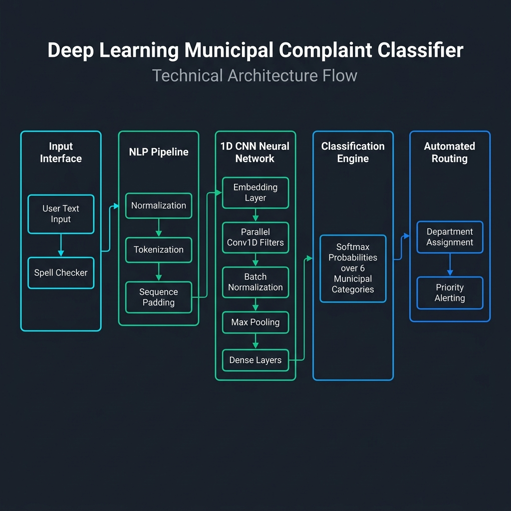

# Municipal Complaint Classifier & Smart Dispatch Engine

[](https://www.python.org/)
[](https://tensorflow.org/)
[](https://streamlit.io/)
[]()
[](LICENSE)

An intelligent, Deep Learning-powered municipal grievance classification and dispatch engine built using a **1D Convolutional Neural Network (CNN)** and **Natural Language Processing (NLP)** pipeline. The application automatically categorizes unstructured citizen complaints (e.g., Water Leakages, Power Outages, Potholes, Road Damage, Garbage Overflow) into relevant municipal departments and assigns priority levels with downloadable JSON dispatch tickets.

---

## 🏛️ System Architecture



### High-Level End-to-End Workflow

1. **Input Interface & Spell Correction**:
   - **Repeated Character Reduction**: Converts runs of 3+ repeated characters (e.g., `gaaarbbbage` → `garbage`, `heeeelp` → `help`).
   - **Contextual Typo Correction**: Utilizes `pyspellchecker` to map misspelled words to standard municipal lexicon.
2. **NLP Tokenization & Padding**:
   - Cleans non-alphanumeric noise, normalizes text, tokenizes into word sequences, and applies sequence padding to a fixed vector length ($N = 60$).
3. **1D CNN Model Architecture**:
   - **Embedding Layer**: 64-dimensional learned dense word representation.
   - **Regularization**: `SpatialDropout1D` (0.4) and L2 Regularization (0.01) to prevent over-fitting.
   - **Parallel Conv1D Extractors**: Three parallel 1D convolutional layers with kernel sizes of `2`, `3`, and `4` (capturing bi-grams, tri-grams, and 4-grams) with 64 filters each, Batch Normalization, and `GlobalMaxPooling1D`.
   - **Dense Classification Head**: Concatenated feature representations routed through dense layers (128 → 64 units) with Dropout (0.6) to a 6-class Softmax layer.
4. **Automated Department & Priority Dispatch**:
   - Categorizes grievance into one of 6 classes, assigns department routing, flags emergency priority, and generates an official downloadable JSON ticket.

---

## 📊 Classification Categories & Department Routing

| Category | Assigned Department | Priority Level | Emergency Response |
| :--- | :--- | :--- | :--- |
| **Water Leakage** | Water Supply Department | 🔴 High | Immediate Field Crew Alert |
| **Water Shortage** | Water Supply Department | 🔴 High | Tanker Dispatch Pipeline |
| **Power Cut** | Electricity Board | 🔴 High | Grid Inspection Unit |
| **Pothole** | Roads & Infrastructure | 🟡 Medium | Road Patch Work Ticket |
| **Road Damage** | Roads & Infrastructure | 🟡 Medium | Maintenance Inspection |
| **Garbage Overflow** | Sanitation & Solid Waste | 🟢 Low | Routine Sanitation Truck |

---

## 🎯 Model Performance & Metrics

Retrained and evaluated on **1,943 annotated citizen grievance records**:

- **Overall Test Accuracy**: **92.54%**
- **Classification Performance Breakdown**:

| Category | Precision | Recall | F1-Score | Support |
| :--- | :---: | :---: | :---: | :---: |
| **Garbage** | 0.90 | 0.98 | 0.94 | 65 |
| **Leakage** | 0.95 | 0.90 | 0.93 | 83 |
| **Pothole** | 0.90 | 0.97 | 0.93 | 58 |
| **Power Cut** | 0.97 | 0.94 | 0.95 | 67 |
| **Road Damage** | 0.94 | 0.80 | 0.86 | 59 |
| **Shortage** | 0.89 | 0.96 | 0.92 | 57 |
| **Macro Average** | **0.93** | **0.93** | **0.92** | **389** |

---

## 💻 Quickstart & Local Setup

### 1. Clone Repository
```bash
git clone https://github.com/Mahesh702p/Municipal_Corporation_MPR.git
cd Municipal_Corporation_MPR
```

### 2. Set Up Virtual Environment
```bash
python3 -m venv venv

# Linux / MacOS
source venv/bin/activate

# Windows (Command Prompt)
venv\Scripts\activate.bat
```

### 3. Install Dependencies
```bash
pip install -r requirements.txt
```

### 4. Launch Application
```bash
streamlit run src/app.py
```
The Web UI will be accessible locally at `http://localhost:8501`.

---

## 📂 Project Structure

```
Municipal_Corporation_MPR/
├── data/
│   └── municipal_complaints_clean.csv   # Dataset (1,943 records)
├── models/
│   ├── cnn_category_model.keras        # Trained Keras 1D CNN model
│   ├── cnn_tokenizer.pkl               # Tokenizer vocabulary artifact
│   ├── cnn_label_encoder.pkl           # Category Label Encoder artifact
│   └── cnn_config.pkl                  # Hyperparameter configuration
├── src/
│   ├── app.py                          # Streamlit Web Application & Dashboard
│   ├── predict.py                      # CLI & Standalone Prediction Engine
│   └── train.py                        # Model Training & Evaluation Pipeline
├── architecture_diagram.png            # Visual System Architecture Flow
├── requirements.txt                    # Project Python Dependencies
└── README.md                           # Documentation
```

---

## 🤝 Contributing & License

Contributions are welcome! Please feel free to open an Issue or submit a Pull Request.

This project is open-source under the [MIT License](LICENSE).
